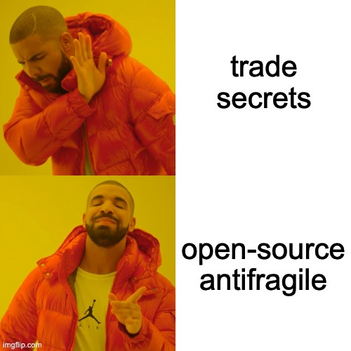
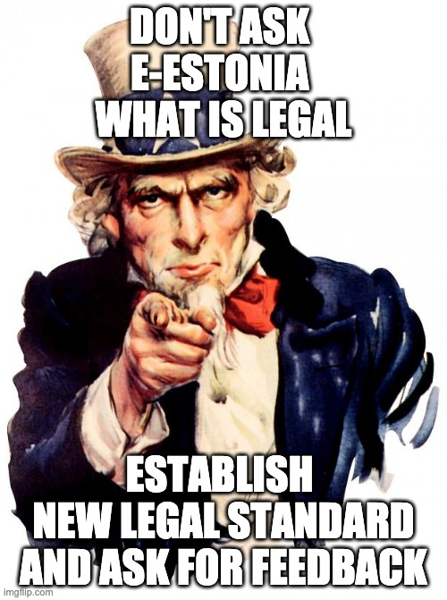

`2020-07-06` article on Medium fundraising strategy update: https://medium.com/@basexisland/fundraising-strategy-incentives-3cb3e765624e

`2020-07-26` article on Medium about the legal framework: https://medium.com/@basexisland/the-legal-framework-in-estonia-1cc705b7fb63

# open-source and anti-fragile

Transparency is our competetive advantage.

We would like to invite legal experts in Estonia to advise on the process.

Currently we identified a number of [issues](https://github.com/basexisland/legal/issues). Github account is required to comment. If creating Github account is an obstacle, then our email address is `info` `basexisland` `com` 💌

1. [Reasons for Estonia](https://github.com/basexisland/legal/issues/1)
2. [Financing the purchase - accepting money from investors](https://github.com/basexisland/legal/issues/2)
3. [Protecting the investors](https://github.com/basexisland/legal/issues/3)
4. [Crowdfunding](https://github.com/basexisland/legal/issues/4)
5. [Tokenized equity](https://github.com/basexisland/legal/issues/5)
6. [Ability to accept and hold crypto currencies](https://github.com/basexisland/legal/issues/6)
7. [Affiliate / referral / commission](https://github.com/basexisland/legal/issues/7)
8. [Prepayment presale](https://github.com/basexisland/legal/issues/8)
9. [Due diligence on real-estate purchase](https://github.com/basexisland/legal/issues/9)
10. [Corporate bylaws](https://github.com/basexisland/legal/issues/10)
11. [Conflict of interest between me the person / the business owner / the investors?](https://github.com/basexisland/legal/issues/11)
12. [Detailed legal structure](https://github.com/basexisland/legal/issues/12)

I have contacted Finantsinspektsioon some time ago: https://twitter.com/basexisland/status/1248526075518496768

Got the reply:

> Finantsinspektsioon has received your e-mail concerning establishment of company and raising funds from investors in Estonia.

> First I deem it necessary to explain and refer to subsection 2(1) of the Estonian Financial Supervision Authority Act, according to which the competence of Finantsinspektsioon as the state financial supervisory authority is determined by law and providing legal advice to market participants and third parties does not fall into the competence of Finantsinspektsioon.

> Therefore, should you need any additional assistance with further analysis of your planned activities, we suggest that you seek assistance from the professional providers of legal services. You can find the Estonian law offices’ contacts on the website of the Estonian Bar Association https://www.advokatuur.ee/eng/law-offices/law-offices.

Messaged all the banks: https://twitter.com/basexisland/status/1248526075518496768

In the similar fashion will message all the lawyers... It is very imporant to someone who is aligned with the vision and is passionate about their work.

I would like to get the official approval from Finantsinspektsioon. First the legal work, legal research, setting up the structure, then asking them for approval.

My personal attitude, **always balance**:
* Top dollar for top services.
* Paralegal rate for "save as PDF" from a public registry.

**Always balance.** I understand professional legal firms do not work for free, at the same time I would kindly ask for a friendly offer:

* our work is fully transparent and open source, we would like to call you "official legal partner" and promote on our website and marketing materials

* we would like to focus our finances to obtain the land in the first place (phase 1). Once it is accomplished, we will have more time to raise additional funds to develop real-estate (phase 2) and continue using your services

**Always balance.**

Book a meeting with me here: https://calendly.com/marsxr/basex or simply start putting comments into the Github [issues](https://github.com/basexisland/legal/issues)

PS. I really want to compensate you fairly. I had a one unpleasant encounter:

> Maybe we can "start small" and I hire you for 1 hour meeting so that you can advise me (me and my legal entity) about the best way moving forward?

The amount of fees reminds me RyanAir at it's finest. I will not name the firm, I still like them, maybe we will end up working together in the future, I'm just aware that it's way too complicated just to have a meeting:

> * Will fulfil the instructions for a fixed fee of EUR 1000 (+VAT)
> * Initial AML due diligence for a new client 250 EUR (VAT excluded)
> * Initial AML due diligence for a new case 150 EUR (VAT excluded)
> * Monitoring 150 EUR (VAT excluded) / per each 6-month period, starting from the signing of the client agreement.
